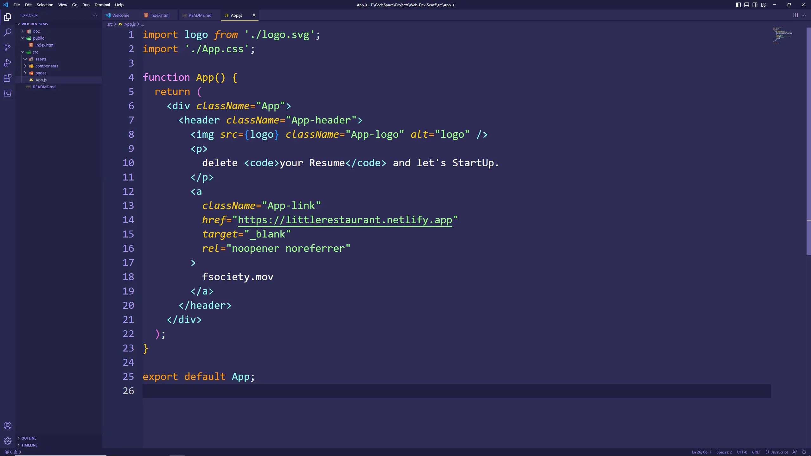

<h1 align="center">Little Restaurant<br>a frontend project with IBM SkillBuild</h1>


<p align="center">
  
</p>


<h2>About</h2>


<h2>Ingredients</h2>
<p align="center">
  
	
	
	
	
  
  
	
	
</p>


<h2>Project Structure</h2>

```
$PROJECT_ROOT
├──server
└──client
    ├── public          # Entry point
    └── src
        ├── assets      # Media files
        ├── components  # UI components
        ├── utils       # Custom hooks and helpers
        └── pages       # Linked pages

```


<h2>Project Documentation</h2>
<p>
  <a href="https://google.com" target="_blank">👉 Link</a>
</p>


<h2>Team Members</h2>
<a href="https://github.com/jay-neo" target="_blank"></a>

    


